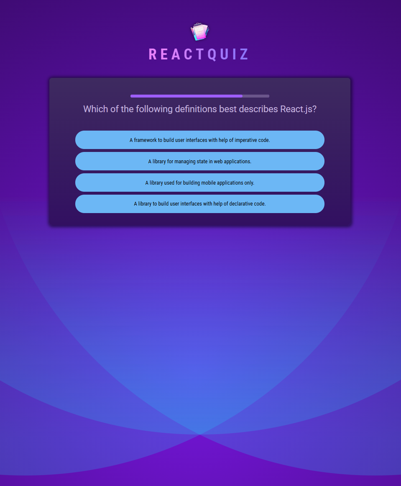

# React Effects Advanced - React Quiz App

A React app that allows users to take a quiz, where they can select answers, skip questions, and view a summary of their performance. It uses React state management and hooks like useState, useEffect, and useCallback to handle user interactions and quiz flow.
<br><br>


## 🚀 Getting Started

### **Prerequisites**
Make sure you have the following installed before running the project:
- **Node.js** (Download from [nodejs.org](https://nodejs.org/))
- **npm** or **yarn** (Comes with Node.js)
<br>

### **Installation**
1. Clone this repository:
   ```sh
   git clone https://github.com/nathenpriyonggo/react-effects-adv
   ```
2. Navigate to the directory
   ```sh
   cd react-effects-adv
   ```
3. Install dependencies:
   ```sh
   npm install
   ```
4. Start the development server:
   ```sh
   npm run dev
   ```
5. Open ```http://localhost:5173/``` in your browser.
<br>

## 🛠️ Built With
- **React** - A JavaScript library for building user interfaces
- **Vite** - A fast build tool for modern web projects
- **React Hooks** – For managing state and side effects
<br>

## 🎮 App Features
- **Multiple Choice Questions** – Users can select answers to questions from a shuffled list.
- **Timer for Each Question** – Each question has a countdown timer.
- **Answer Validation** – Users see whether their answer is correct or wrong.
- **Quiz Summary** – After completing the quiz, a summary displays the user's score, showing percentages for correct, wrong, and skipped answers.
- **Responsive Modal Dialogs** – Uses React Portals for rendering confirmation and summary dialogs.
<br>

## 🖥️ Preview
<p align="center"></p>
<br>

## 📜 License
This project is open-source. Feel free to fork, modify, and expand upon it!
<br><br>


---

✨ Happy coding! 🚀
